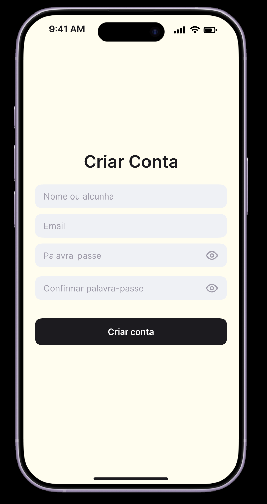
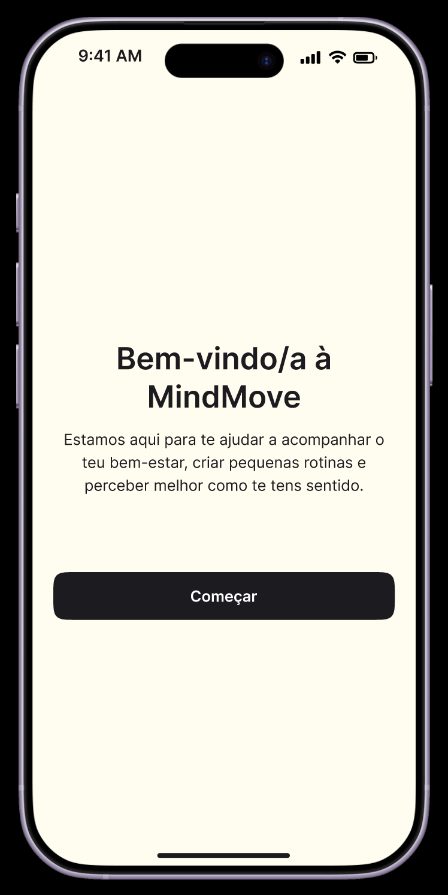
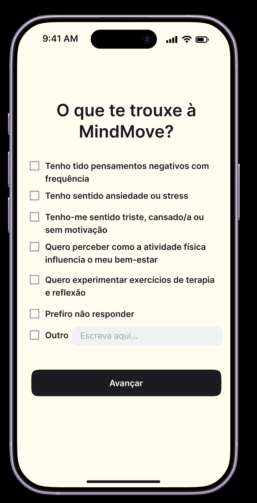
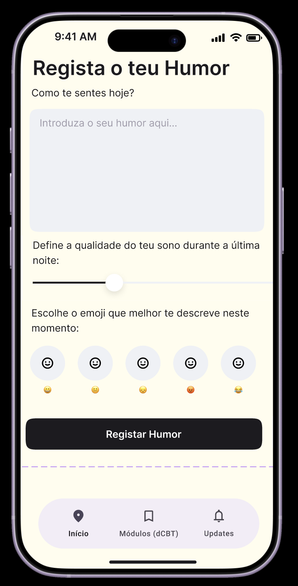
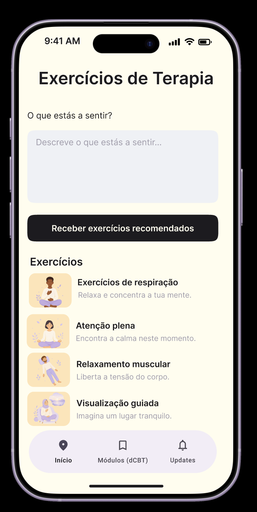
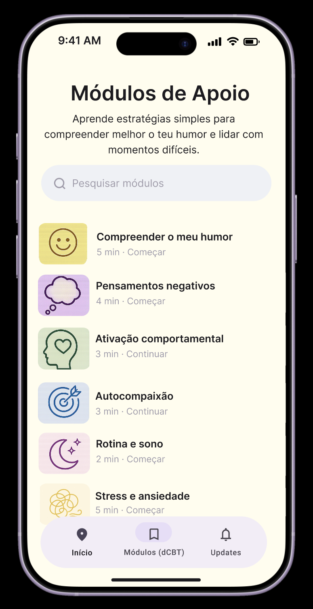
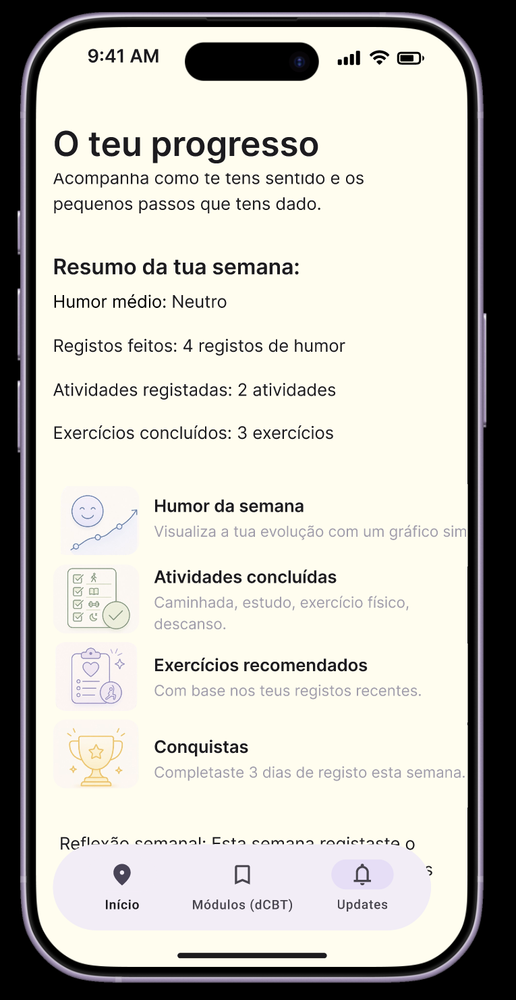
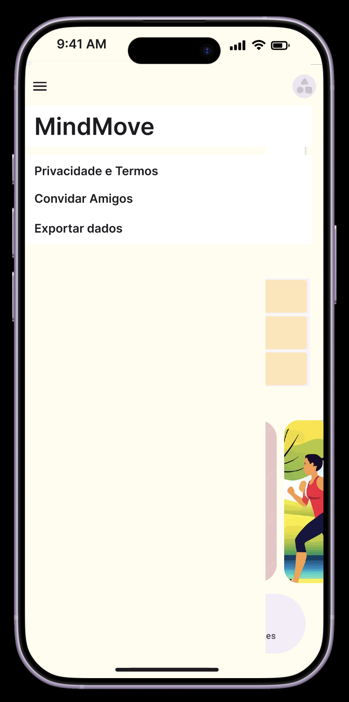
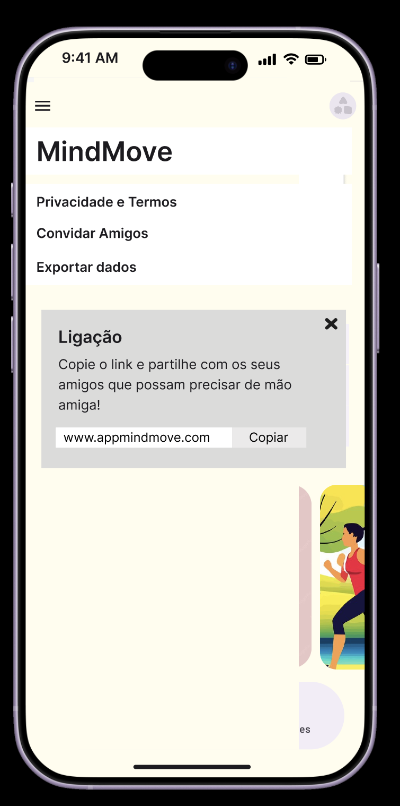
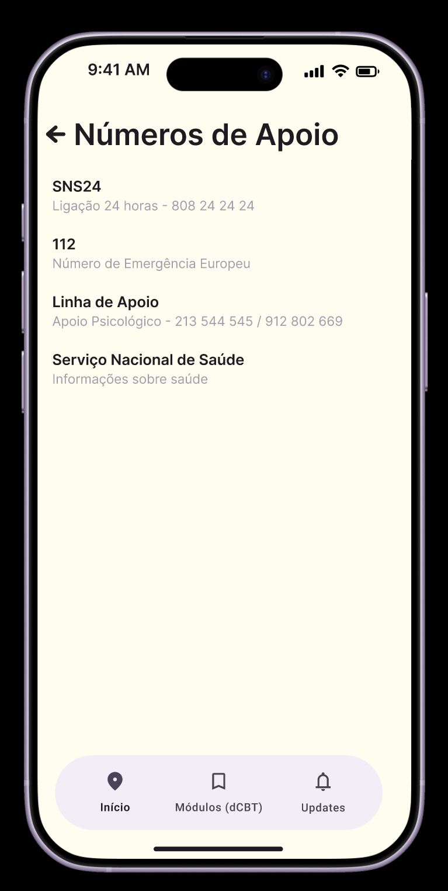

## Documentos para Download 

### REDCap (PDF's)
* [📄 Identificação](identificacao.pdf)
* [📄 Baseline](baselinenovo.pdf)
* [📄 Screening](screeningnovo.pdf)
* [📄 Follow-up 4 semanas](followup4wnovo.pdf)
* [📄 Follow-up 8 semanas](followup8wnovo.pdf)
* [📄 Conclusão](conclusaonovo.pdf)

### Dados e Tabelas (Excel)
* [📊 Dicionário ](DicionarioFinal.xlsx)

## Protótipo MindMove

Link para o protótipo no Figma: [🔗 Protótipo MindMove](https://www.figma.com/proto/sKP43gk3E8MP4f8iGNVOdJ/Sem-t%C3%ADtulo?node-id=1-3&t=6ABgreLeLtXEU4mu-1)

Aqui estão os ecrãs principais do nosso protótipo:

   

