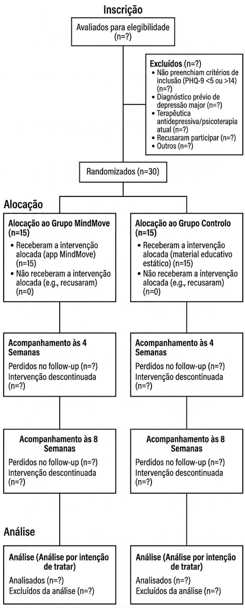
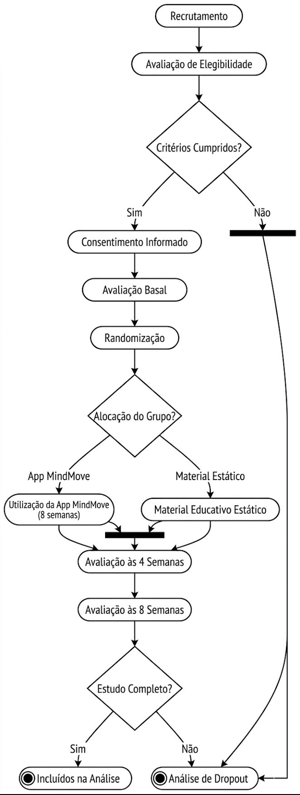
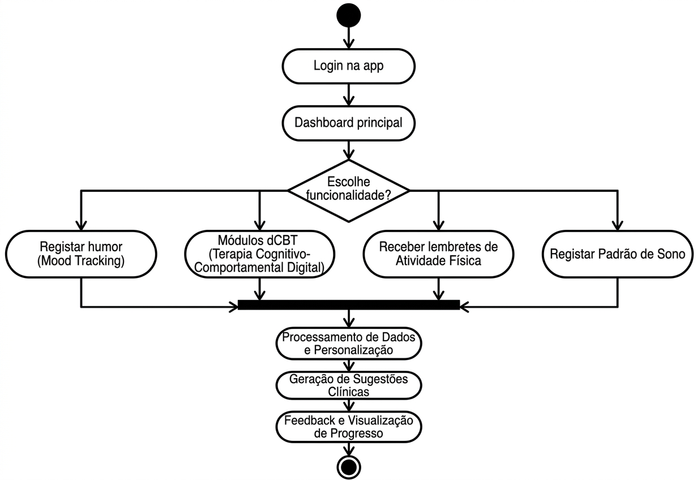
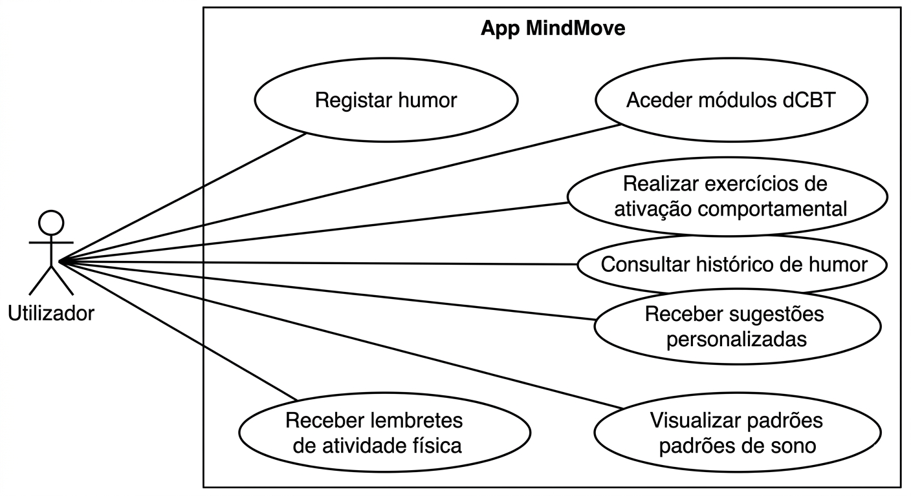
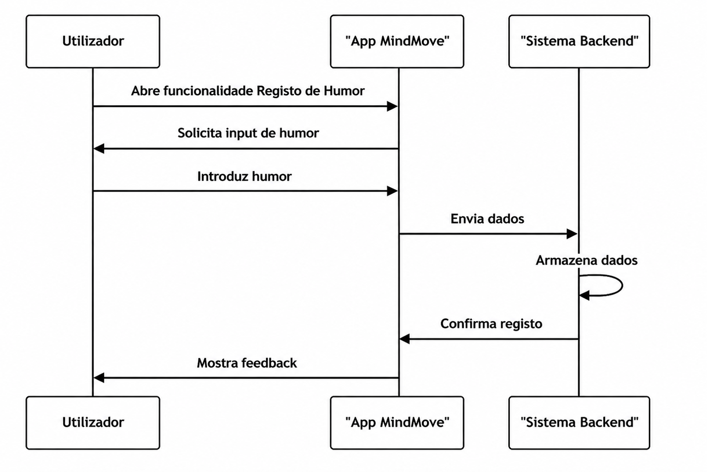

# Protocolo de Ensaio Clínico

## Informação Administrativa

### Título do Estudo

Eficácia da aplicação móvel MindMove na redução de sintomas depressivos em estudantes universitários entre os 18 e os 30 anos com sintomatologia depressiva ligeira a moderada (PHQ-9 entre 5 e 14), sem diagnóstico de depressão major e sem terapêutica antidepressiva atual, comparativamente a lista de espera com material educativo estático, avaliada pela variação do score do Patient Health Questionnaire-9 às 8 semanas: protocolo de um ensaio clínico randomizado controlado.

### Título Abreviado

Eficácia da app MindMove na depressão ligeira universitária: ECR

### Autores e Afiliações

- Afonso Santos (FMUP)  
- Carlota Ferreira (FMUP)  
- Duarte Oliveira (FMUP)  
- Joana Antunes (FMUP)  

**Instituição:** Faculdade de Medicina da Universidade do Porto  
**Contacto:** up202505689@up.pt  

### Identificação do Ensaio

- Tipo: Ensaio clínico randomizado, controlado, paralelo  
- Data de início: [2026-03-03]  
- Data de conclusão: [2026-06-02]  

# 1. Introdução

## 1.1 Racional

A depressão constitui uma das principais causas de incapacidade entre jovens adultos a nível global, com particular expressão na população universitária, caracterizada por elevada exposição a stressores académicos, transições desenvolvimentais e vulnerabilidade psicossocial. Estudos epidemiológicos indicam prevalências elevadas de sintomatologia depressiva clinicamente relevante neste grupo etário, com impacto significativo no desempenho académico, funcionamento social, risco de abandono escolar e qualidade de vida. Mesmo quando os sintomas se situam na faixa ligeira a moderada, como operacionalizado por um score entre 5 e 14 no Patient Health Questionnaire-9, estes associam-se a risco aumentado de agravamento clínico e de recorrência futura, justificando intervenções precoces e escaláveis.
Apesar da disponibilidade de serviços de saúde mental nas universidades, persistem barreiras substanciais ao acesso e à utilização de cuidados convencionais, incluindo estigma, listas de espera prolongadas, limitações de recursos humanos especializados e constrangimentos logísticos. Intervenções presenciais estruturadas, embora eficazes, apresentam dificuldades de implementação em larga escala e custos elevados. Adicionalmente, estudantes com sintomatologia ligeira a moderada frequentemente não preenchem critérios para intervenção prioritária, permanecendo numa zona intermédia de necessidade clínica não plenamente satisfeita.
As intervenções digitais, nomeadamente aplicações móveis baseadas em princípios de terapia cognitivo-comportamental, autorregulação emocional e monitorização de sintomas, emergem como estratégias promissoras para aumentar o acesso, promover autonomia e reduzir barreiras estruturais. Evidência preliminar sugere que aplicações móveis podem produzir reduções modestas a moderadas em sintomas depressivos, particularmente quando incorporam componentes interativas, feedback personalizado e estratégias de ativação comportamental. Contudo, muitos estudos apresentam limitações metodológicas, incluindo amostras heterogéneas, ausência de comparadores adequados ou curta duração de seguimento.
O presente ensaio clínico randomizado visa avaliar a eficácia da aplicação MindMove na redução do score do PHQ-9 às 8 semanas, em comparação com lista de espera associada a material educativo estático. A escolha deste comparador permite controlar o efeito de informação básica e acesso a recursos, isolando o impacto específico da intervenção digital ativa. Este estudo pretende colmatar a lacuna de evidência robusta em estudantes universitários com sintomatologia ligeira a moderada, fornecendo dados clinicamente relevantes para informar estratégias de prevenção secundária e modelos de cuidados escalonados em contexto académico.

## 1.2 Objetivos

### Objetivo Primário

O objetivo primário deste ensaio é avaliar a eficácia da aplicação móvel MindMove na redução da sintomatologia depressiva, medida pelo score no PHQ-9 às 8 semanas, em estudantes universitários entre os 18 e os 30 anos com sintomas depressivos ligeiros a moderados.

### Objetivos Secundários

Como objetivos secundários pretende-se: avaliar a proporção de participantes que atingem remissão sintomática (PHQ-9 <5) às 8 semanas; avaliar alterações na ansiedade medida pelo GAD-7, no nível de atividade física semanal e na qualidade do sono (PSQI); analisar a adesão e o engagement com a aplicação MindMove, incluindo tempo de uso e módulos completados; e avaliar a satisfação com a intervenção, a manutenção dos efeitos terapêuticos no follow-up às 8 semanas, bem como a taxa de dropout.

# 2. Métodos

## 2.1 Desenho do Estudo

Trata-se de um ensaio clínico randomizado, controlado, de grupos paralelos, com alocação 1:1 entre o grupo de intervenção (MindMove) e o grupo comparador em lista de espera com material educativo estático. O estudo será conduzido num único serviço de psicologia universitário, envolvendo um pré-teste de 30 participantes (15 por grupo). A duração total por participante é de 8 semanas de intervenção, com avaliações de outcomes às 4 e 8 semanas.

Timeline

| Fase            | Duração       | Descrição                         |
|-----------------|--------------|----------------------------------|
| Recrutamento    | 4 semanas    | Identificação e seleção          |
| Baseline        | 1 semana     | Avaliação inicial                |
| Intervenção     | 8 semanas    | Período ativo                    |
| Follow-up       | 4 e 8 semanas| Avaliação de outcomes            |

## 2.2 População do Estudo

### 2.2.1 Critérios de Inclusão

- Idade: Jovens adultos entre os 18 e 30 anos (inclusive).
- Estado Clínico: Presença de sintomas depressivos de intensidade ligeira a moderada, que sejam validados por uma pontuação entre 5 e 14 no PHQ-9.
- Capacidade Tecnológica: Posse de um dispositivo pessoal (Android ou iOS) com acesso à internet.

### 2.2.2 Critérios de Exclusão

- Gravidade Clínica: Diagnóstico prévio de Depressão Major ou pontuação PHQ-9 superior a 14.
- Risco Agudo: Qualquer pontuação superior a 0 no item 9 do PHQ-9.
- Relação Terapêutica: Utilização diária de medicação antidepressiva ou psicoterapia regular.

## 2.3 Intervenções

O grupo de intervenção terá acesso à aplicação móvel MindMove durante um período de 8 semanas. A aplicação inclui módulos de terapia cognitivo-comportamental digital (dCBT), exercícios de ativação comportamental, registo de humor (mood tracking), lembretes de atividade física, técnicas de mindfulness guiadas, monitorização de padrões de sono e sugestões personalizadas baseadas no humor do utilizador.
O grupo controlo será colocado em lista de espera, tendo acesso apenas a material educativo estático, incluindo brochuras sobre saúde mental e uma lista de recursos disponíveis, sem intervenção ativa durante o estudo. Após a conclusão do ensaio, será oferecido acesso à aplicação MindMove aos participantes do grupo controlo.

# 3. Avaliações e Outcomes

## 3.1 Outcome Primário

PHQ-9 Patient Health Questionnaire-9) score
Instrumento: O Patient Health Questionnaire-9 (PHQ-9) é um instrumento de autorrelato validado, composto por 9 itens, utilizado para avaliar a gravidade da sintomatologia depressiva nas últimas duas semanas. Cada item é pontuado de 0 a 3, resultando num score total entre 0 e 27, sendo valores mais elevados indicativos de maior gravidade.

Momento de avaliação: O PHQ-9 será administrado no baseline, às 4 semanas e às 8 semanas, sendo a avaliação às 8 semanas considerada para análise do outcome primário.

Definição de sucesso: O sucesso da intervenção será definido como uma redução estatisticamente significativa do score do PHQ-9 às 8 semanas no grupo de intervenção comparativamente ao grupo controlo. Adicionalmente, será explorada a proporção de participantes que atingem remissão sintomática, definida como PHQ-9 < 5.

## 3.2 Outcomes Secundários

- Ansiedade avaliada através do GAD-7 (Generalized Anxiety Disorder-7)
- Nível de atividade física semanal, medido em minutos de atividade física autorreportada
- Qualidade do sono avaliada pelo PSQI (Pittsburgh Sleep Quality Index)

## 3.3 Análise Estatística

A análise estatística será realizada de acordo com o princípio de intention-to-treat, incluindo todos os participantes randomizados. Inicialmente, será efetuada uma análise descritiva das características basais dos participantes, utilizando médias e desvios padrão para variáveis contínuas e frequências relativas para variáveis categóricas.
Para o outcome primário (PHQ-9 às 8 semanas), será utilizada uma análise de covariância (ANCOVA), ajustando para o valor basal do PHQ-9, de forma a comparar as diferenças entre o grupo de intervenção e o grupo controlo.
Os outcomes secundários (GAD-7, atividade física e PSQI) serão analisados utilizando modelos lineares mistos para avaliar a evolução ao longo do tempo (baseline, 4 e 8 semanas) e a interação entre grupo e tempo.
A taxa de dropout será analisada descritivamente e comparada entre grupos. Serão conduzidas análises de sensibilidade para avaliar o impacto de dados em falta, recorrendo a métodos de imputação apropriados, como multiple imputation.
O nível de significância estatística será definido como p < 0.05. Todas as análises serão realizadas utilizando software estatístico apropriado (e.g., R ou SPSS).

## 3.4 Fluxograma CONSORT

## 3.5 Diagrama de Atividades

Percurso do Participante no Estudo Clínico

Percurso do Utilizador na App MindMove

## 3.6 Diagrama de Casos de Uso

## 3.7 Diagrama de Sequência – Registo de Humor

# 4. Ética e Disseminação

Todos os participantes fornecerão consentimento informado antes da inclusão no estudo. A confidencialidade dos dados será assegurada através da anonimização da informação e armazenamento seguro dos dados.
O protocolo será submetido para aprovação por uma comissão de ética competente antes do início do estudo.
Os resultados do ensaio serão disseminados através de publicações científicas e apresentações em conferências, independentemente da direção dos resultados. 

# 5. Notas de Desenvolvimento

## Decisões Pendentes
- Definir o limiar de diferença clinicamente significativa para o PHQ-9
- Estabelecer a estratégia de análise para dados em falta e taxa de dropout

## Dúvidas
- Clarificar critérios operacionais para classificação de sintomas depressivos ligeiros a moderados (PHQ-9 5–14)
- Definir procedimentos de apoio e encaminhamento para participantes com agravamento dos sintomas

# Referências

- Schulz KF, Altman DG, Moher D. CONSORT 2010 statement: updated guidelines for reporting parallel group randomised trials. BMJ. 2010;340:c332. doi:10.1136/bmj.c332.
- Spitzer RL, Kroenke K, Williams JB, Löwe B. A brief measure for assessing generalized anxiety disorder: the GAD-7. Arch Intern Med. 2006;166(10):1092–1097. doi:10.1001/archinte.166.10.1092.
- Torous J, Nicholas J, Larsen ME, Firth J, Christensen H. Clinical review of user engagement with mental health smartphone apps: Evidence, theory and improvements. Evid Based Ment Health. 2018;21(3):116–119. doi:10.1136/ebmental-2018-300091.
- Firth J, Torous J, Nicholas J, Carney R, Rosenbaum S, Sarris J. The efficacy of smartphone-based mental health interventions for depressive symptoms: a meta-analysis of randomized controlled trials. World Psychiatry. 2017;16(3):287–298. doi:10.1002/wps.20472.
- OpenAI. ChatGPT (March 2026 version) [large language model]. Available at: https://chat.openai.com/. Accessed March 2026.
